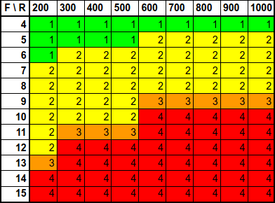

# solc_runs_tests

## 📖 Table of Contents


<!-- TOC -->

- [solc_runs_tests](#solc_runs_tests)
	- [📖 Table of Contents](#-table-of-contents)
	- [🔭 Overview](#-overview)
	- [✏️ compiler parameters](#-compiler-parameters)
	- [📝 Results](#-results)
	- [🌲 Repository Tree](#-repository-tree)

<!-- /TOC -->


## 🔭 Overview


This repository is a testbed to experiment with optimizing Solidity compiler (*`solc`*) by launching compilation on it. The goal here is to see the effects of the **number of public functions** in a solidity smart contract and the **level of optimization** of `solc` solidity compiler on the bytecodes of the "*function dispatcher*".

**Three PHP scripts** are used !

1. `solc_runs_tests_files.php` : to **generate solidity source code** with a variable number of public functions. See files `FunctionDispatcher_XX.sol` with `XX` in range `4 to 15` corresponding to the number of functions.

2. `solc_runs_tests_evm.php` : proceed to an **automatic solidity compilation** of scripts previously created, with a level of optimization from `200 to 1000`. The compilation output (*opcodes*) are write in dedicated folders (*see [repository tree](#-repository-tree)*) with names corresponding to runs level and number of functions.

```php
$cmd = "solc --asm --overwrite --optimize-runs {$run} -o {$output} {$sol_file}";
system($cmd);
```
3. `solc_runs_tests_analyze.php` : proceed to a **static analyzis** of opcodes (from the differents file output) and count `tags` label on "*function dispatcher*" sections, corresponding to the number of sequential linear selector tests. And output results as **CSV** and **Markdown** data array.

**Note !**
The solidity compiler `solc` version was set on **0.8.20**.


## ✏️ compiler parameters

**Runs level**
```
Optimizer Options:
  --optimize-runs n (=200)
      The number of runs specifies roughly how often each 
      opcode of the deployed code will be executed across the 
      lifetime of the contract. Lower values will optimize 
      more for initial deployment cost, higher values will 
      optimize more for high-frequency usage.
```


**Opcodes output**
```
Output Components:
    --asm    EVM assembly of the contracts.
```


## 📝 Results




----


## 🌲 Repository Tree
```bash
.
├── array.csv
├── array.md
├── array.png
├── FunctionDispatcher_10.sol
├── FunctionDispatcher_11.sol
├── FunctionDispatcher_12.sol
├── FunctionDispatcher_13.sol
├── FunctionDispatcher_14.sol
├── FunctionDispatcher_15.sol
├── FunctionDispatcher_4.sol
├── FunctionDispatcher_5.sol
├── FunctionDispatcher_6.sol
├── FunctionDispatcher_7.sol
├── FunctionDispatcher_8.sol
├── FunctionDispatcher_9.sol
└── output
    ├── 1000_10
    ├── 1000_11
    ├── 1000_12
    ├── 1000_13
    ├── 1000_14
    ├── 1000_15
    ├── 1000_4
    ├── 1000_5
    ├── 1000_6
    ├── 1000_7
    ├── 1000_8
    ├── 1000_9
    ├── 200_10
    ├── 200_11
    ├── 200_12
    ├── 200_13
    ├── 200_14
    ├── 200_15
    ├── 200_4
    ├── 200_5
    ├── 200_6
    ├── 200_7
    ├── 200_8
    ├── 200_9
    ├── 300_10
    ├── 300_11
    ├── 300_12
    ├── 300_13
    ├── 300_14
    ├── 300_15
    ├── 300_4
    ├── 300_5
    ├── 300_6
    ├── 300_7
    ├── 300_8
    ├── 300_9
    ├── 400_10
    ├── 400_11
    ├── 400_12
    ├── 400_13
    ├── 400_14
    ├── 400_15
    ├── 400_4
    ├── 400_5
    ├── 400_6
    ├── 400_7
    ├── 400_8
    ├── 400_9
    ├── 500_10
    ├── 500_11
    ├── 500_12
    ├── 500_13
    ├── 500_14
    ├── 500_15
    ├── 500_4
    ├── 500_5
    ├── 500_6
    ├── 500_7
    ├── 500_8
    ├── 500_9
    ├── 600_10
    ├── 600_11
    ├── 600_12
    ├── 600_13
    ├── 600_14
    ├── 600_15
    ├── 600_4
    ├── 600_5
    ├── 600_6
    ├── 600_7
    ├── 600_8
    ├── 600_9
    ├── 700_10
    ├── 700_11
    ├── 700_12
    ├── 700_13
    ├── 700_14
    ├── 700_15
    ├── 700_4
    ├── 700_5
    ├── 700_6
    ├── 700_7
    ├── 700_8
    ├── 700_9
    ├── 800_10
    ├── 800_11
    ├── 800_12
    ├── 800_13
    ├── 800_14
    ├── 800_15
    ├── 800_4
    ├── 800_5
    ├── 800_6
    ├── 800_7
    ├── 800_8
    ├── 800_9
    ├── 900_10
    ├── 900_11
    ├── 900_12
    ├── 900_13
    ├── 900_14
    ├── 900_15
    ├── 900_4
    ├── 900_5
    ├── 900_6
    ├── 900_7
    ├── 900_8
    └── 900_9

109 directories
```
